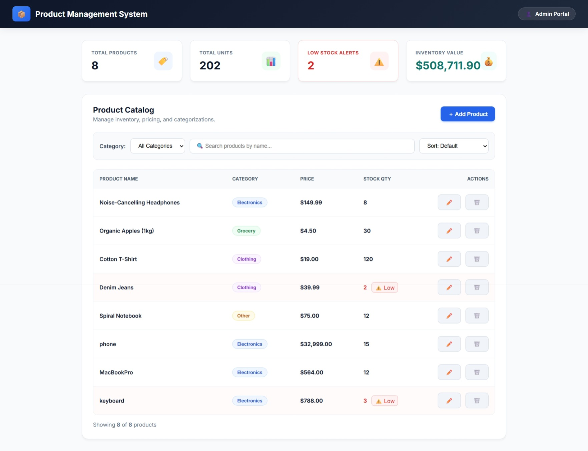
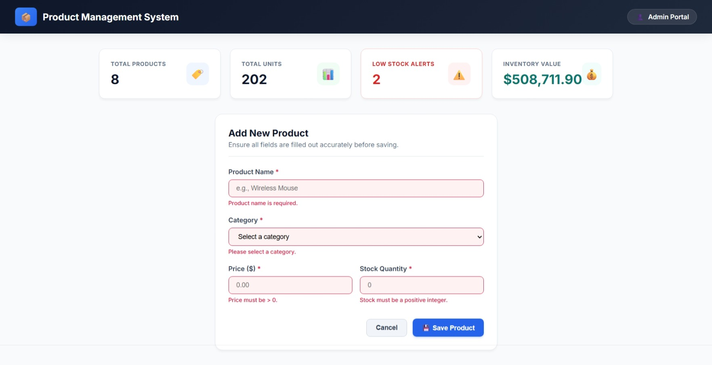
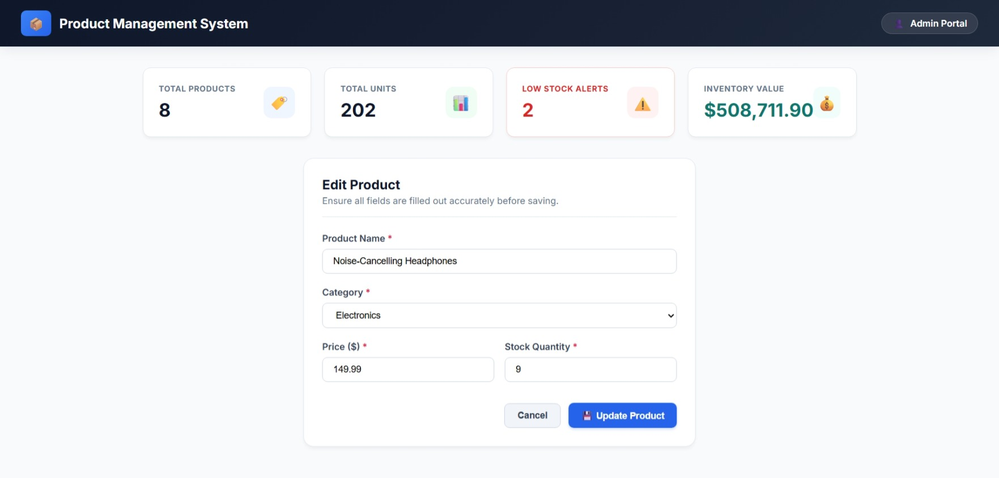
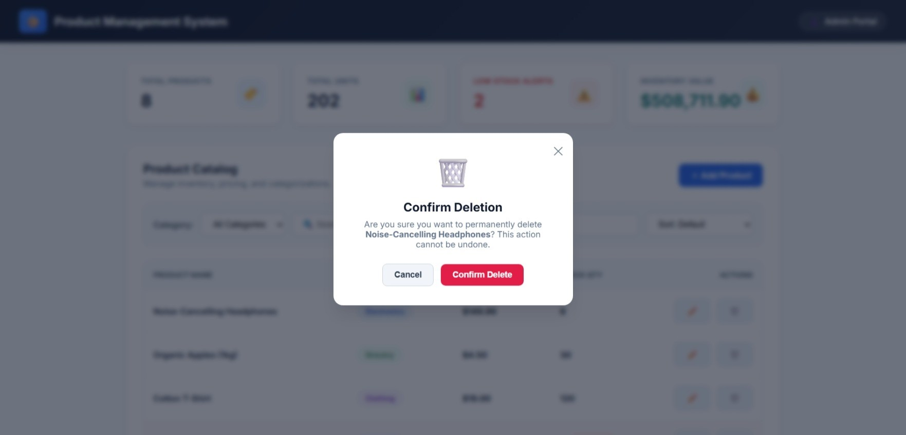
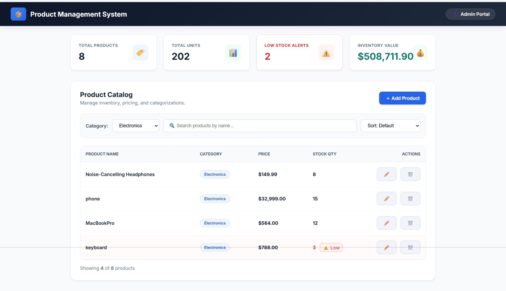
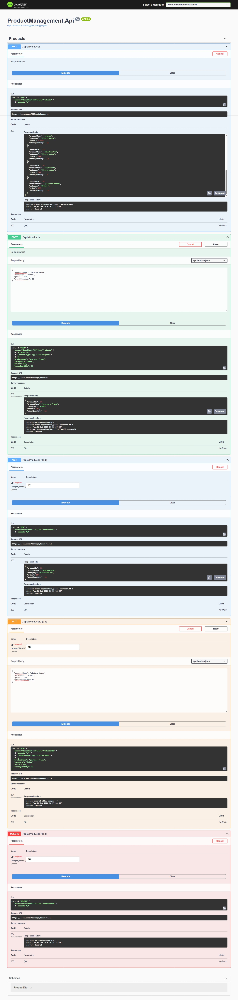
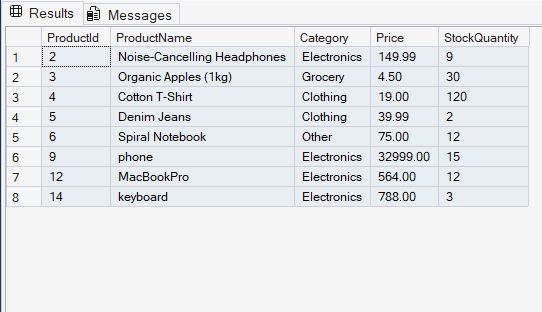

# 🛍️ Product Management System

### Full-Stack Product Catalog Management Application

A full-stack **Product Management System** developed using **React, ASP.NET Core Web API, Entity Framework Core, and SQL Server**.

The application provides a simple and structured way to manage products through a web-based dashboard, with CRUD operations, category filtering, low-stock identification, validation, and database persistence.

---

## 📌 Table of Contents

* [Project Overview](#-project-overview)
* [Key Features](#-key-features)
* [System Architecture](#-system-architecture)
* [Application Flow](#-application-flow)
* [Project Structure](#-project-structure)
* [Backend Architecture](#-backend-architecture)
* [Product Data Model](#-product-data-model)
* [REST API](#-rest-api)
* [Validation and Business Rules](#-validation-and-business-rules)
* [Frontend](#-frontend)
* [Database](#-database)
* [Technology Stack](#-technology-stack)
* [Screenshots](#-screenshots)
* [Prerequisites](#-prerequisites)
* [Installation and Setup](#-installation-and-setup)
* [Running the Application](#-running-the-application)
* [Testing](#-testing)
* [Requirements Coverage](#-requirements-coverage)
* [Technical Concepts Demonstrated](#-technical-concepts-demonstrated)
* [Future Enhancements](#-future-enhancements)
* [Project Outcome](#-project-outcome)
* [Author](#-author)

---

## 📖 Project Overview

The **Product Management System** is a full-stack web application designed to manage product information efficiently.

The project follows a layered backend architecture where responsibilities are separated between the **API, Service, and Data Access layers**.

The React frontend communicates with the ASP.NET Core Web API, while Entity Framework Core handles communication between the application and SQL Server.

### Main objective

The system allows users to:

* View all products
* Add new products
* Edit existing products
* Delete products
* Search and filter products
* Identify products with low stock
* Validate product information
* Persist product data in SQL Server

The project demonstrates how a frontend application, REST API, business logic, data-access layer, and relational database work together as a complete application.

---

## ✨ Key Features

### 📦 Product Management

* Display all available products
* Add new products
* Edit existing product details
* Delete products
* Retrieve individual product details

### 🔎 Search and Filtering

* Search products
* Filter products by category
* View products based on stock availability

### ⚠️ Low Stock Identification

Products with a stock quantity below the defined threshold are identified as **low-stock products**.

Current low-stock condition:

`StockQuantity < 5`

This allows users to quickly identify products that may require restocking.

### ✅ Product Validation

The application validates product information before it is stored or updated.

Validation includes:

* Product name cannot be empty
* Category is required
* Price must be greater than zero
* Stock quantity cannot be negative

### 🗑️ Delete Confirmation

A confirmation step is provided before deleting a product to reduce accidental deletion.

### 📊 Dashboard

The frontend provides a dashboard-style interface for viewing and managing product information.

### 🔌 REST API

The backend exposes RESTful API endpoints for product operations and can be tested through Swagger/OpenAPI.

---

## 🏗️ System Architecture

The backend follows a **3-Tier Layered Architecture**.

```text
                    ┌──────────────────────────┐
                    │        React UI          │
                    │      Frontend Layer      │
                    └────────────┬─────────────┘
                                 │ HTTP Requests
                                 ▼
                    ┌──────────────────────────┐
                    │   ProductManagement.Api  │
                    │      API / Controller     │
                    └────────────┬─────────────┘
                                 │
                                 ▼
                    ┌──────────────────────────┐
                    │ ProductManagement.Services│
                    │    Business Logic Layer   │
                    └────────────┬─────────────┘
                                 │
                                 ▼
                    ┌──────────────────────────┐
                    │ ProductManagement.       │
                    │       DataAccess         │
                    │ Repository / Data Layer  │
                    └────────────┬─────────────┘
                                 │
                                 ▼
                    ┌──────────────────────────┐
                    │       SQL Server         │
                    │        Database          │
                    └──────────────────────────┘
```

### Why layered architecture?

Each layer has a specific responsibility.

| Layer      | Responsibility                      |
| ---------- | ----------------------------------- |
| API        | Handles HTTP requests and responses |
| Services   | Contains business logic             |
| DataAccess | Handles database operations         |
| SQL Server | Stores persistent product data      |
| React      | Provides the user interface         |

This separation makes the application easier to understand, maintain, test, and extend.

---

## 🔄 Application Flow

### GET Request

When the user opens the product dashboard:

```text
React Frontend
      ↓
ProductsController
      ↓
IProductService
      ↓
ProductService
      ↓
IProductRepository
      ↓
ProductRepository
      ↓
Entity Framework Core
      ↓
SQL Server
      ↓
Database Result
      ↓
React UI
```

### POST Request

When the user adds a product:

```text
React Form
    ↓
POST Request
    ↓
ProductsController
    ↓
ProductDto
    ↓
ProductService
    ↓
ProductRepository
    ↓
Entity Framework Core
    ↓
SQL Server
```

### PUT Request

When the user edits a product:

```text
React Edit Form
      ↓
PUT Request
      ↓
ProductsController
      ↓
ProductDto
      ↓
ProductService
      ↓
ProductRepository
      ↓
Entity Framework Core
      ↓
SQL Server
```

### DELETE Request

When a product is deleted:

```text
React UI
   ↓
Delete Confirmation
   ↓
DELETE Request
   ↓
ProductsController
   ↓
ProductService
   ↓
ProductRepository
   ↓
Entity Framework Core
   ↓
SQL Server
```

---

## 📁 Project Structure

```text
ProductManagementSystem/
│
├── ProductManagement.Api/
│   ├── Controllers/
│   │   └── ProductsController.cs
│   │
│   ├── DTOs/
│   │   └── ProductDto.cs
│   │
│   └── Program.cs
│
├── ProductManagement.DataAccess/
│   ├── Interfaces/
│   │   └── IProductRepository.cs
│   │
│   ├── Models/
│   │   └── Product.cs
│   │
│   └── Repositories/
│       └── ProductRepository.cs
│
├── ProductManagement.Services/
│   ├── Interfaces/
│   │   └── IProductService.cs
│   │
│   └── Services/
│       └── ProductService.cs
│
├── ProductManagementFrontend/
│   ├── public/
│   ├── src/
│   ├── package.json
│   └── ...
│
├── ProductManagementSnapshots/
│   ├── add-product-validation
│   ├── backend-swagger-api
│   ├── dashboard-overview
│   ├── delete-confirmation-modal
│   ├── edit-product-form
│   ├── filter
│   └── sql-database-records
│
├── database_setup.sql
└── README.md
```

---

## 🧩 Backend Architecture

### 1. API Layer

Project:

`ProductManagement.Api`

Main responsibilities:

* Receive HTTP requests
* Route requests to appropriate controller actions
* Validate request models
* Return appropriate HTTP responses
* Expose REST API endpoints
* Provide Swagger/OpenAPI documentation

Main controller:

`ProductsController`

---

### 2. Service Layer

Project:

`ProductManagement.Services`

Main responsibilities:

* Implement business logic
* Process requests from controllers
* Communicate with repository interfaces
* Keep business rules separate from API and database code

Main components:

`IProductService`

`ProductService`

---

### 3. Data Access Layer

Project:

`ProductManagement.DataAccess`

Main responsibilities:

* Manage database operations
* Define product model
* Implement repository operations
* Communicate with Entity Framework Core

Main components:

`Product`

`IProductRepository`

`ProductRepository`

---

## 🗃️ Product Data Model

The system manages products using the following information:

| Field         | Description                      |
| ------------- | -------------------------------- |
| ProductId     | Unique identifier of the product |
| ProductName   | Name of the product              |
| Category      | Product category                 |
| Price         | Product price                    |
| StockQuantity | Available stock quantity         |

### Product categories

The application supports product categorization such as:

* Electronics
* Grocery
* Clothing
* Other

---

## 🌐 REST API

The backend exposes the following product endpoints.

| Method | Endpoint             | Purpose                    |
| ------ | -------------------- | -------------------------- |
| GET    | `/api/products`      | Retrieve all products      |
| GET    | `/api/products/{id}` | Retrieve a product by ID   |
| POST   | `/api/products`      | Add a new product          |
| PUT    | `/api/products/{id}` | Update an existing product |
| DELETE | `/api/products/{id}` | Delete a product           |

### HTTP response handling

The API uses appropriate HTTP status codes depending on the operation.

| Status Code | Meaning                                 |
| ----------- | --------------------------------------- |
| 200         | Request completed successfully          |
| 201         | Resource successfully created           |
| 204         | Request completed with no response body |
| 400         | Invalid request or validation failure   |
| 404         | Requested resource not found            |

---

## 📝 Validation and Business Rules

The application applies validation before processing product information.

### Product Name

* Required
* Cannot be empty or blank

### Category

* Required

### Price

* Must be greater than `0`

### Stock Quantity

* Must be greater than or equal to `0`

### Low Stock

A product is considered low-stock when:

```text
StockQuantity < 5
```

This condition is also used by the frontend to help users identify products requiring attention.

---

## ⚛️ Frontend

The frontend is developed using **React**.

It provides the user interface for interacting with the product management API.

### Frontend responsibilities

* Display product information
* Provide product forms
* Send API requests
* Display validation messages
* Search products
* Filter products
* Identify low-stock products
* Confirm product deletion
* Refresh displayed data after operations

### Frontend-to-backend communication

```text
React Component
      ↓
HTTP Request
      ↓
ASP.NET Core Web API
      ↓
Service Layer
      ↓
Repository Layer
      ↓
SQL Server
```

The response is then returned through the same application layers to the React frontend.

---

## 🗄️ Database

The application uses **Microsoft SQL Server** for persistent storage.

The database contains a product table that stores the product information required by the application.

A database setup script is included in the repository:

`database_setup.sql`

This script can be used to help recreate the required database structure and sample data.

### Database flow

```text
Application
    ↓
Entity Framework Core
    ↓
SQL Server
    ↓
Products Table
```

---

## 🛠️ Technology Stack

### Frontend

* React
* JavaScript
* HTML
* CSS

### Backend

* C#
* ASP.NET Core Web API
* .NET
* REST API

### Data Access

* Entity Framework Core
* Repository Pattern

### Database

* Microsoft SQL Server

### API Documentation

* Swagger / OpenAPI

### Development Tools

* Visual Studio
* Visual Studio Code
* SQL Server Management Studio
* Git
* GitHub

---

## 📸 Screenshots

### Dashboard Overview



The dashboard provides an overview of the available products and their current information.

---

### Add Product Validation



The application validates product details before accepting the submitted information.

---

### Edit Product



Existing product information can be modified through the edit form.

---

### Delete Confirmation



A confirmation dialog is displayed before deleting a product.

---

### Product Filtering



Products can be filtered based on the available categories.

---

### Swagger API



Swagger provides an interactive interface for testing the backend REST API.

---

### SQL Server Records



The database records demonstrate persistent product information stored in SQL Server.

---

## 💻 Prerequisites

Before running the project, install the following:

### Backend

* .NET SDK
* Visual Studio
* ASP.NET Core development workload
* SQL Server

### Database

* SQL Server Management Studio

### Frontend

* Node.js
* npm

### Version Control

* Git

---

## ⚙️ Installation and Setup

### Step 1 — Clone the Repository

Clone the project repository to your local machine.

```bash
git clone <repository-url>
```

Navigate to the project directory:

```bash
cd ProductManagementSystem
```

---

### Step 2 — Configure SQL Server

1. Open SQL Server Management Studio.
2. Connect to your SQL Server instance.
3. Open the `database_setup.sql` file.
4. Execute the script.
5. Verify that the database and product records have been created.

---

### Step 3 — Configure the Backend

Open the backend solution in Visual Studio.

Verify the database connection configuration in the API project.

The connection string should point to the SQL Server instance containing the Product Management database.

---

### Step 4 — Restore Backend Dependencies

From Visual Studio:

1. Open the solution.
2. Restore NuGet packages.
3. Build the solution.
4. Resolve any local SQL Server configuration differences if required.

---

### Step 5 — Run the Backend

Run the `ProductManagement.Api` project from Visual Studio.

Once the API starts successfully, Swagger can be used to verify the available endpoints.

---

### Step 6 — Install Frontend Dependencies

Open a terminal inside:

```text
ProductManagementFrontend
```

Run:

```bash
npm install
```

---

### Step 7 — Start the React Application

Run:

```bash
npm run dev
```

The frontend will start using the development server configuration provided by the React project.

---

## ▶️ Running the Application

The complete application requires both the backend API and React frontend.

### Backend

```text
React Frontend
      ↓
ASP.NET Core Web API
      ↓
Service Layer
      ↓
Repository Layer
      ↓
SQL Server
```

### User workflow

1. Start SQL Server.
2. Start the ASP.NET Core Web API.
3. Verify the API through Swagger.
4. Start the React frontend.
5. Open the frontend application.
6. View the product dashboard.
7. Add, edit, filter, search, or delete products.
8. Verify changes in the application and database.

---

## 🧪 Testing

The application can be tested at multiple levels.

### API Testing

Swagger can be used to test:

* Get all products
* Get product by ID
* Add product
* Update product
* Delete product

### Validation Testing

Examples include:

* Empty product name
* Missing category
* Zero or negative price
* Negative stock quantity

### Functional Testing

The following scenarios can be verified:

* Product creation
* Product retrieval
* Product modification
* Product deletion
* Category filtering
* Low-stock identification
* Database persistence
* Delete confirmation

### Database Verification

After performing CRUD operations, the SQL Server database can be checked to confirm that the data has been correctly persisted.

---

## 📋 Requirements Coverage

| Requirement                  | Implementation |
| ---------------------------- | -------------- |
| Product creation             | Implemented    |
| Product retrieval            | Implemented    |
| Product update               | Implemented    |
| Product deletion             | Implemented    |
| Product search               | Implemented    |
| Category filtering           | Implemented    |
| Low-stock identification     | Implemented    |
| Product validation           | Implemented    |
| Delete confirmation          | Implemented    |
| REST API                     | Implemented    |
| SQL Server persistence       | Implemented    |
| Swagger API documentation    | Implemented    |
| React frontend               | Implemented    |
| Layered backend architecture | Implemented    |

---

## 🧠 Technical Concepts Demonstrated

This project demonstrates practical implementation of:

* ASP.NET Core Web API
* RESTful API design
* C#
* Object-Oriented Programming
* Dependency Injection
* Interfaces
* Service Layer
* Repository Pattern
* 3-Tier Architecture
* Entity Framework Core
* SQL Server
* DTOs
* HTTP methods
* HTTP status codes
* API validation
* React
* Frontend-backend integration
* CRUD operations
* Search and filtering
* Git and GitHub
* Swagger / OpenAPI

---

## 🔐 Separation of Responsibilities

The project maintains separation of responsibilities across the application.

```text
Controller
   │
   │ Handles HTTP requests
   ▼
Service
   │
   │ Handles business logic
   ▼
Repository
   │
   │ Handles data access
   ▼
Entity Framework Core
   │
   │ Database communication
   ▼
SQL Server
```

This approach prevents database-specific logic from being directly placed inside controllers and keeps the application organized into independent layers.

---

## 🚀 Future Enhancements

Possible future improvements include:

* Authentication and authorization
* Role-based access control
* Pagination
* Advanced product search
* Sorting options
* Product image support
* Inventory alerts
* Dashboard analytics
* Unit testing
* Centralized exception handling
* Logging
* Deployment to a cloud platform

These features are outside the current implementation scope and can be added as the application evolves.

---

## 🎯 Project Outcome

The project demonstrates the complete flow of a full-stack application:

```text
User
 ↓
React Frontend
 ↓
REST API
 ↓
Controller
 ↓
Service
 ↓
Repository
 ↓
Entity Framework Core
 ↓
SQL Server
```

The application brings together frontend development, backend API development, business logic, data-access patterns, database management, validation, and API testing into a single working system.

---

## 👩‍💻 Author

### Monisha P

Computer Science and Engineering Graduate

This project was developed as part of hands-on training and practical application development to strengthen skills in:

* C#
* ASP.NET Core
* Entity Framework Core
* SQL Server
* REST APIs
* React
* Full-Stack Development

---

## 📌 Project Status

**Current Scope:** Product Management and Low-Stock Identification

**Architecture:** 3-Tier Layered Architecture

**Backend:** ASP.NET Core Web API

**Frontend:** React

**Database:** SQL Server

**API Documentation:** Swagger / OpenAPI

---

<p align="center">
  <strong>Product Management System</strong>
  <br>
  Built with React • ASP.NET Core • Entity Framework Core • SQL Server
</p>
